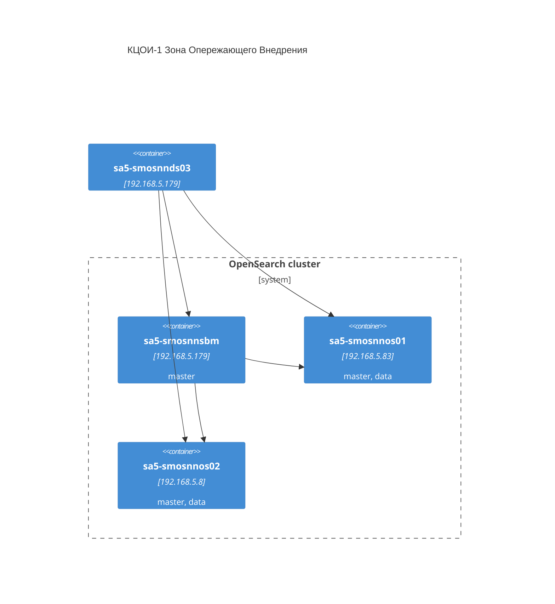

```mermaid

C4Context
    title КЦОИ-1 Зона Опережающего Внедрения

    Container(sa5-smosnnds03, "sa5-smosnnds03", "192.168.5.179")

    Boundary(os, "OpenSearch cluster") {
        Container(sa5-smosnnsbm, "sa5-smosnnsbm", "192.168.5.179", "master")
        Container(sa5-smosnnos01, "sa5-smosnnos01", "192.168.5.83", "master, data")
        Container(sa5-smosnnos02, "sa5-smosnnos02", "192.168.5.8", "master, data")
    }

    Rel(sa5-smosnnds03, sa5-smosnnsbm, "")
    Rel(sa5-smosnnds03, sa5-smosnnos01, "")
    Rel(sa5-smosnnds03, sa5-smosnnos02, "")

    Rel(sa5-smosnnsbm, sa5-smosnnos01, "")
    Rel(sa5-smosnnsbm, sa5-smosnnos02, "")


```
