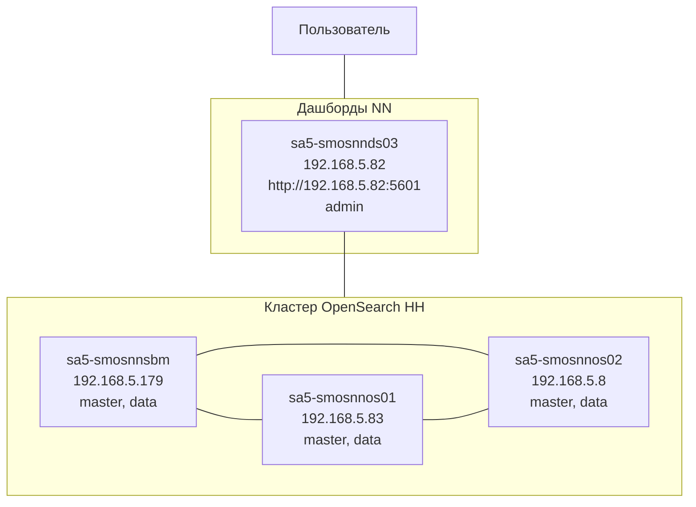
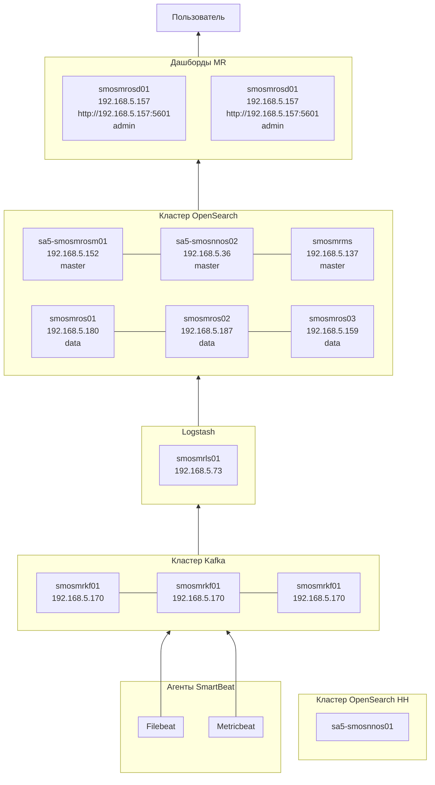

```mermaid

C4Context
    title КЦОИ-1 Зона Опережающего Внедрения

    Container(sa5-smosnnds03, "sa5-smosnnds03", "192.168.5.82")

    Boundary(os, "OpenSearch cluster") {
        Container(sa5-smosnnsbm, "sa5-smosnnsbm", "192.168.5.179", "master")
        Container(sa5-smosnnos01, "sa5-smosnnos01", "192.168.5.83", "master, data")
        Container(sa5-smosnnos02, "sa5-smosnnos02", "192.168.5.8", "master, data")
    }

    Rel(sa5-smosnnds03, sa5-smosnnsbm, "")
    Rel(sa5-smosnnds03, sa5-smosnnos01, "")
    Rel(sa5-smosnnds03, sa5-smosnnos02, "")

    Rel(sa5-smosnnsbm, sa5-smosnnos01, "")
    Rel(sa5-smosnnsbm, sa5-smosnnos02, "")


```


```mermaid
graph TD

    user[Пользователь]

    subgraph ds[Дашборды NN]
        sa5-smosnnds03[sa5-smosnnds03\n192.168.5.82\nhttp://192.168.5.82:5601\nadmin]
    end

    subgraph osnn["Кластер OpenSearch НН"]
        
        sa5-smosnnsbm[sa5-smosnnsbm
            192.168.5.179
            master, data
        ]
        sa5-smosnnos01[sa5-smosnnos01
            192.168.5.83
            master, data
        ]
        sa5-smosnnos02[sa5-smosnnos02
            192.168.5.8
            master, data
        ]
    end

user --- ds
sa5-smosnnds03 --- osnn
sa5-smosnnsbm --- sa5-smosnnos01
sa5-smosnnsbm --- sa5-smosnnos02
sa5-smosnnos01 --- sa5-smosnnos02

```


```mermaid
graph BT

    Person1[Пользователь]

    subgraph ds[Дашборды MR]
%%        direction TD
        Dash01[smosmrosd01\n192.168.5.157\nhttp://192.168.5.157:5601\nadmin]
        Dash02[smosmrosd01\n192.168.5.157\nhttp://192.168.5.157:5601\nadmin]
    end
    
    subgraph osnn["Кластер OpenSearch НН"]
        sa5-smosnnos01s01[sa5-smosnnos01]
    end

    subgraph os["Кластер OpenSearch"]

        direction LR

        sa5-smosmrosm01[sa5-smosmrosm01
            192.168.5.152
            master] ---

        osa5-smosnnos02s02[sa5-smosnnos02
            192.168.5.36
            master] ---

        smosmrms[smosmrms
            192.168.5.137
            master]

        smosmros01[smosmros01
            192.168.5.180
            data] ---

        smosmros02[smosmros02
            192.168.5.187
            data] ---

        smosmros03[smosmros03
            192.168.5.159
            data]

    end

    subgraph ls["Logstash"]
        smosmrls01[smosmrls01
        192.168.5.73]
    end

    subgraph kfk["Кластер Kafka"]
        direction LR
        smosmrkf01[smosmrkf01
        192.168.5.170] ---
        smosmrkf02[smosmrkf01
        192.168.5.170] ---
        smosmrkf03[smosmrkf01
        192.168.5.170]
    end

    subgraph agents[Агенты SmartBeat]
        subgraph fb[Filebeat]
        end
        subgraph mb[Metricbeat]
        end
    end

fb ---> kfk
mb ---> kfk
kfk ---> ls
ls ---> os
os ---> ds
ds --> Person1
```
```

```
